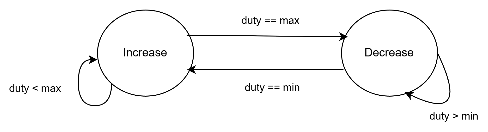

# 第 2 週學生作答紀錄
## 練習 1

### 指令
```powershell
iverilog -g2012 -o build/param_counter_width_5.out src/param_counter.sv sim/tb_param_counter_width_5.sv
vvp build/param_counter_width_5.out
gtkwave build/param_counter_width_5.vcd     
```
### 修改檔案
- 可以查看
    - 模擬： `./sim/tb_param_counter_width_5.sv`
    - build：
        - `param_counter_5.out`
        - `param_counter.vcd`

### 思考：為什麼 `src/param_counter.sv` 不需要修改？
因為有將 `WIDTH` 參數化，使得 module 可以根據模擬時調整相依於 `WIDTH` 的參數，包含了 `count` 寬度等等。

## 練習 2：加入遞減模式

答案參考 `up_down_counter.sv`

## 練習 3：PWM 呼吸燈的思考題



## 練習 4：驗收問答

1. `parameter` 可以在建立模組實例時由外部修改；`localparam` 是模組內部使用的常數，不能在建立實例時從外部修改。
2. `'0` 會自動配合目標訊號的位元寬度，將所有 bit 設為 0。`8'd0` 則固定是 8-bit；當計數器的 WIDTH 改變時，`'0` 更適合參數化設計。
3. 因為 `4-bit` 可以表達的大小落在 0 - 15， 其中有 0 - 7 的輸出狀態皆會小於 8 ， 代表會有一半的時間會輸出 1 的訊號
4. 如果某些條件下沒有對輸出賦值，輸出就必須保留前一次的值，因此綜合工具可能推導出鎖存器（ `latch`：沒有時脈、會保留舊值的儲存元件）。
兩級同步器與除彈跳（選做）
5. 參考答案：
    按鍵是相對於 FPGA 時脈的非同步輸入，兩級同步器用來降低亞穩態（metastability：訊號未能及時穩定為 0 或 1）傳入後續電路的風險。除彈跳則用來過濾機械按鍵在按下或放開瞬間產生的多次快速跳動。兩者處理的是不同問題，所以都需要考慮。